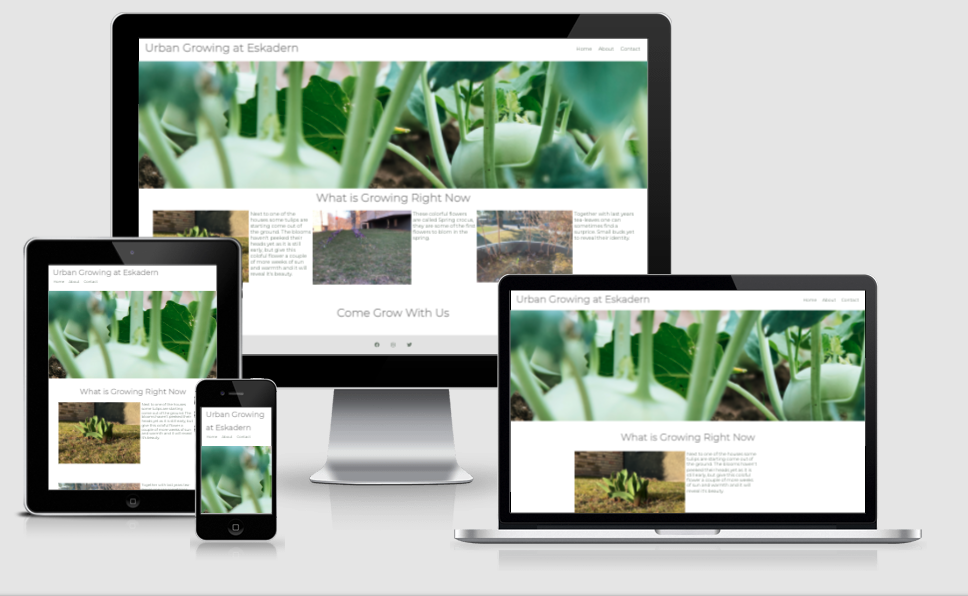
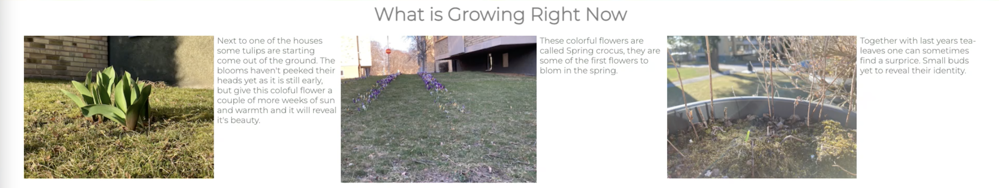
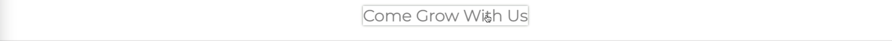
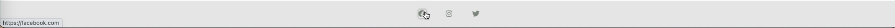
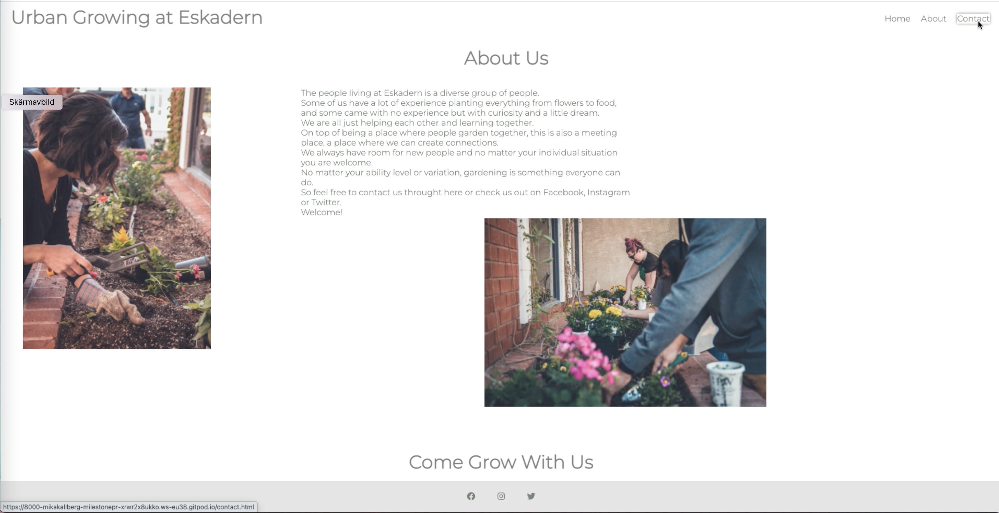
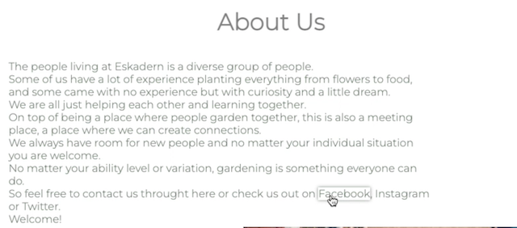
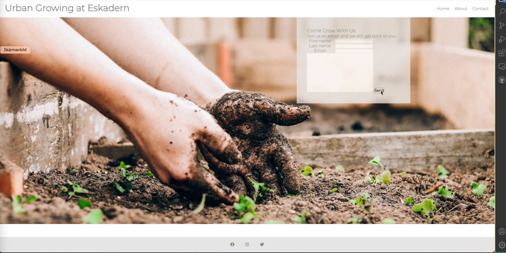

# The Urban Growing at Eskadern

The Urban Growing at Eskadern is a local urban grower society directed at the residents of the area who may or may not have knowledge in planting a garden. All are welcome.
The area mostly comprise of apartment buildings, so there is no real way of having a garden of your own. But residents coming together in the communal spaces planting a garden, not only provides a beautiful garden, it is also a learning opportunity and a chance for people to meet and create bonds.

## Features 

### Existing Features

- __Navigation Bar__

  - Featured on all three pages, the full responsive navigation bar includes links to the Logo, Home page, About us and contact page and is identical in each page to allow for easy navigation. When the user hovers over the links a shadow appears to indicate for the user what they are about to click.
  - This feature allows the user to able to navigate between the different pages i´without having to press the browsers back or forward navigation. And the can always find their way back to home page. 

 

- __The landing page image__

  - To identify the landing page and also set the tone for the over all content the below image is used. This image also ties in to the 404.Error page.

- __What is growing now__

  - The what is growing now section is the first introduction to The Urban Growing at Eskadern.
  -it is meant to give the user an up to date insight to what is happening at that season in the garden.
  -Embeded in the text content are external links to wikipedia pages about the different flowers that are growing in this particular season.
  -All external links have a noopener and a noreferrer, to increase security for the user. So malicious code can't interfer as the user is transported from our page to the external site.

- __Come Grow With Us__

  - This section is the first linked expressiv invitation to the user, to join the society.This bar is also present just above the footer on the About page.
  -It responds when the user hovers over it by creating a shadow behind it, letting the suer know they are about to take action.

- __The Footer__ 

  - The footer includes links to social media sites for The Urban Growing at Eskadern. As this is a small society they probably have a Facebook and Instagram page, and as this is a little bit more media savy group they also have Twitter. The links will open to a new tab to allow easy navigation for the user. 
  -All external links have a noopener and a noreferrer, to increase security for the user. So malicious code can't interfer as the user is transported from our page to the external site.
  - The footer is another way for the user to connect with the society.

- __About Us__

  - The about us page gives the user a little bit more information about the inclusive values of The Urban Growing at Eskadern. 
  - This section allows the user to get to know the society a little more.
  -There are multiple roads of contact in the content section of the about page. 

-embedded in the text are clickabel links to Facebook, Instagram and Twitter. As with the footer all external links have a noopener and a noreferrer, to increase security for the user. So malicious code can't interfer as the user is transported from our page to the external site.

- __Contact Page__

  - This page allows the user to contact The Urban Growing at Eskadern. It is the only focus.
  -The background image is also used as a content giver. The goal is to give the user inspiration to go out and get their hands dirty in the soil.
  -Visible in the image is also the shadow effect behind the send-button, which is used to give respons to the users actions.

- __Error page__

-If for some reason the user tries to find a page that doesn't exist, a 404.error page appear.
-

### Features Left to Implement

- A better send button
-Actions in the form element, right now it's just static.

## Testing 

In this section, you need to convince the assessor that you have conducted enough testing to legitimately believe that the site works well. Essentially, in this part you will want to go over all of your project’s features and ensure that they all work as intended, with the project providing an easy and straightforward way for the users to achieve their goals.

In addition, you should mention in this section how your project looks and works on different browsers and screen sizes.

You should also mention in this section any interesting bugs or problems you discovered during your testing, even if you haven't addressed them yet.

If this section grows too long, you may want to split it off into a separate file and link to it from here.

### Validator Testing 

- HTML
  - No errors were returned when passing through the official [W3C validator](https://validator.w3.org/nu/?doc=https%3A%2F%2Fcode-institute-org.github.io%2Flove-running-2.0%2Findex.html)
- CSS
  - No errors were found when passing through the official [(Jigsaw) validator](https://jigsaw.w3.org/css-validator/validator?uri=https%3A%2F%2Fvalidator.w3.org%2Fnu%2F%3Fdoc%3Dhttps%253A%252F%252Fcode-institute-org.github.io%252Flove-running-2.0%252Findex.html&profile=css3svg&usermedium=all&warning=1&vextwarning=&lang=en#css)

### Unfixed Bugs

You will need to mention unfixed bugs and why they were not fixed. This section should include shortcomings of the frameworks or technologies used. Although time can be a big variable to consider, paucity of time and difficulty understanding implementation is not a valid reason to leave bugs unfixed. 

## Deployment

This section should describe the process you went through to deploy the project to a hosting platform (e.g. GitHub) 

- The site was deployed to GitHub pages. The steps to deploy are as follows: 
  - In the GitHub repository, navigate to the Settings tab 
  - From the source section drop-down menu, select the Master Branch
  - Once the master branch has been selected, the page will be automatically refreshed with a detailed ribbon display to indicate the successful deployment. 

The live link can be found here - https://code-institute-org.github.io/love-running-2.0/index.html 

## Credits 

In this section you need to reference where you got your content, media and extra help from. It is common practice to use code from other repositories and tutorials, however, it is important to be very specific about these sources to avoid plagiarism. 

You can break the credits section up into Content and Media, depending on what you have included in your project. 

### Content 

- The text for the Home page was taken from Wikipedia Article A
- Instructions on how to implement form validation on the Sign Up page was taken from [Specific YouTube Tutorial](https://www.youtube.com/)
- The icons in the footer were taken from [Font Awesome](https://fontawesome.com/)

### Media

- The photos used on the home and sign up page are from This Open Source site
- The images used for the gallery page were taken from this other open source site

Congratulations on completing your Readme, you have made another big stride in the direction of being a developer! 

## Other General Project Advice

Below you will find a couple of extra tips that may be helpful when completing your project. Remember that each of these projects will become part of your final portfolio so it’s important to allow enough time to showcase your best work! 

- One of the most basic elements of keeping a healthy commit history is with the commit message. When getting started with your project, read through [this article](https://chris.beams.io/posts/git-commit/) by Chris Beams on How to Write  a Git Commit Message 
  - Make sure to keep the messages in the imperative mood 

- When naming the files in your project directory, make sure to consider meaningful naming of files, point to specific names and sections of content.
  - For example, instead of naming an image used ‘image1.png’ consider naming it ‘landing_page_img.png’. This will ensure that there are clear file paths kept. 

- Do some extra research on good and bad coding practices, there are a handful of useful articles to read, consider reviewing the following list when getting started:
  - [Writing Your Best Code](https://learn.shayhowe.com/html-css/writing-your-best-code/)
  - [HTML & CSS Coding Best Practices](https://medium.com/@inceptiondj.info/html-css-coding-best-practice-fadb9870a00f)
  - [Google HTML/CSS Style Guide](https://google.github.io/styleguide/htmlcssguide.html#General)

Getting started with your Portfolio Projects can be daunting, planning your project can make it a lot easier to tackle, take small steps to reach the final outcome and enjoy the process! 
