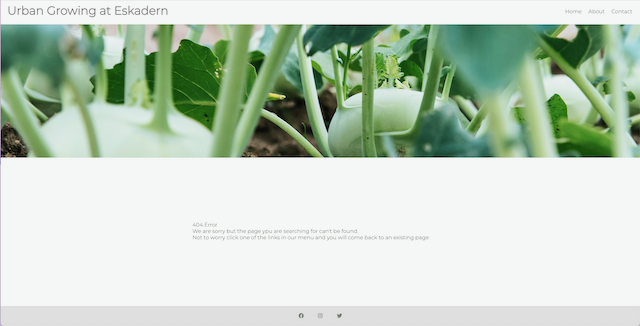

# The Urban Growing at Eskadern

The Urban Growing at Eskadern is a local urban grower society directed at the residents of the area who may or may not have knowledge in planting a garden. All are welcome.
The area mostly comprise of apartment buildings, so there is no real way of having a garden of your own. But residents coming together in the communal spaces planting a garden, not only provides a beautiful garden, it is also a learning opportunity and a chance for people to meet and create bonds.

## Features 

### Existing Features

- __Navigation Bar__

  - Featured on all three pages, the full responsive navigation bar includes links to the Logo, Home page, About us and contact page and is identical in each page to allow for easy navigation. When the user hovers over the links a shadow appears to indicate for the user what they are about to click.
  - This feature allows the user to able to navigate between the different pages i´without having to press the browsers back or forward navigation. And the can always find their way back to home page. 

 

- __The landing page image__

  - To identify the landing page and also set the tone for the over all content the below image is used. This image also ties in to the 404.Error page.

- __What is growing now__

  - The what is growing now section is the first introduction to The Urban Growing at Eskadern.
  - It is meant to give the user an up to date insight to what is happening at that season in the garden.
  - Embeded in the text content are external links to wikipedia pages about the different flowers that are growing in this particular season.
  - All external links have a noopener and a noreferrer, to increase security for the user. So malicious code can't interfer as the user is transported from our page to the external site.

- __Come Grow With Us__

  - This section is the first linked expressiv invitation to the user, to join the society.This bar is also present just above the footer on the About page.
  - It responds when the user hovers over it by creating a shadow behind it, letting the suer know they are about to take action.

- __The Footer__ 

  - The footer includes links to social media sites for The Urban Growing at Eskadern. As this is a small society they probably have a Facebook and Instagram page, and as this is a little bit more media savy group they also have Twitter. The links will open to a new tab to allow easy navigation for the user. 
  - All external links have a noopener and a noreferrer, to increase security for the user. So malicious code can't interfer as the user is transported from our page to the external site.
  - The footer is another way for the user to connect with the society.

- __About Us__

  - The about us page gives the user a little bit more information about the inclusive values of The Urban Growing at Eskadern. 
  - This section allows the user to get to know the society a little more.
  - There are multiple roads of contact in the content section of the about page. 

- Embedded in the text are clickabel links to Facebook, Instagram and Twitter. As with the footer all external links have a noopener and a noreferrer, to increase security for the user. So malicious code can't interfer as the user is transported from our page to the external site.

- __Contact Page__

  - This page allows the user to contact The Urban Growing at Eskadern. It is the only focus.
  -The background image is also used as a content giver. The goal is to give the user inspiration to go out and get their hands dirty in the soil.
  -Visible in the image is also the shadow effect behind the send-button, which is used to give respons to the users actions.

- __Error page__

- If for some reason the user tries to find a page that doesn't exist, a 404.error page appear.
- The Error page is designed to have the same structure as the Home page, this is to connect even a missfired browser to the website.
- A clear message without distractions are used to guide the user to a solution to their problem.

### Features Left to Implement

- A better send button
-Actions in the form element, right now it's just static.

## Testing 

The first testing of the code reveald the following errors and warnings:
HTML code tested using W3C validator:
Index-file:
Seven errors and one warning found.
About-file:
Four erros found
Contact-file:
Two erros found.

CSS code tested using W3C Jigsaw validator
This found one error and nine warnings.

### Validator Testing 

- HTML
  - All HTML code were returned without errors when passing through the official [W3C validator](https://validator.w3.org/nu/#textarea)
  - CSS
  - 1 error was found when passing through the official [(Jigsaw) validator](https://jigsaw.w3.org/css-validator/validator?uri=https%3A%2F%2Fmikakallberg.github.io%2FMilestone-Project-1%2Findex.html&profile=css3svg&usermedium=all&warning=1&vextwarning=&lang=sv)

### Unfixed Bugs

- In the CSS file there is a bug regarding the font-family. Which if changed becomes unusable. The bug doesn't seem to affect the launching or design. So I let it stay as is.

## Deployment
 To deploy this website I used GitHub pages. The following was done.

- The site was deployed to GitHub pages. The steps to deploy are as follows: 
  - In the GitHub repository, navigate to the Settings tab 
  - From the menu to the left pages was selected.
  - From the source section drop-down menu, select the main branch
  - From the select folder drop-down menu, select /(root)
  - Once the main branch and root has been selected, the page will be automatically refreshed with a detailed ribbon display to indicate the successful deployment. 

The live link can be found here - https://mikakallberg.github.io/Milestone-Project-1/index.html

## Credits 

- Firstly I want to credit my fellow students for both being there easing the stress, but also coming up with ideas of solutions.
- Second credit Code Institute and the Walkthrough "Love Running" project. I tried hard to not copy any code, but I have used the structure given in teh video of begining from the top and working my way down. I have also copied the basic structure of this README.md file just to give me the headings and a better understanding. 
- To get the footer to stick to bottom of each page I copied the code given by https://css-tricks.com/couple-takes-sticky-footer/, I have consistenly in text wherever used credited and linked to that webpage in comments to the code.
- To structure the layout of images and also text I've used a combination of a book (HTML&CSS by Jon Duckett), I have gotten help from Student support Tutoring sessions, special acknowledgemnt here to Christine from Code Institute for helping me align the images and text on the index.html page. I have also googled trouble shooting issues. But I haven't copy pasted code. I'm unsure if the credit needs to be more specific then that.

### Content 

- The icons in the footer were taken from [Font Awesome](https://fontawesome.com/)

### Media

- The photos used on the Home page are from two sources. The three small ones are from me and the big header image is from https://www.pexels.com/photo/food-healthy-vegetables-agriculture-121629/. 
- The photos used on the About page are from https://unsplash.com/photos/qo6_mo9dsYg and https://unsplash.com/photos/QMj47_NSmfs. 
- The photos used on the Contact page is from https://unsplash.com/photos/q13Zq1Jufks.
- The photos used on the 404 page are from this site https://www.pexels.com/photo/food-healthy-vegetables-agriculture-121629/.

